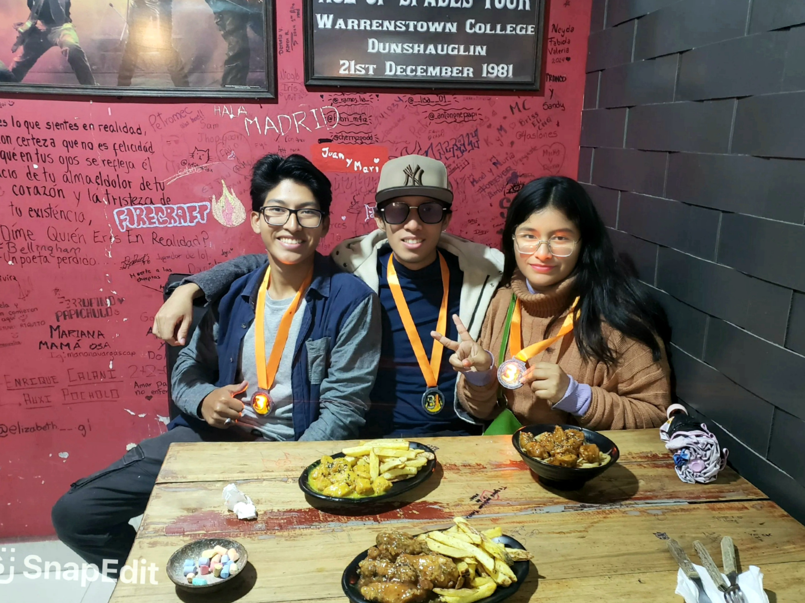

# 🚒 FireTeam App

[](https://github.com/expo/expo)

# 🏆 3rd Place Winner - Hackathon Firebusters 2025!

<p align="center">
  
  <em>Our winning team celebrating at Hackathon Firebusters 2025</em>
</p>

## 🔥 About the Hackathon

Hello! 👋 This project was born during the exciting "Hackathon Firebusters" held on February 22-23, 2025. In just 48 hours of intense coding, coffee ☕ and dedication, our team managed to create a partially functional prototype of an application aimed at saving lives. Our hard work and innovative solution were recognized with the **Third Place** award among all participating teams!

## 💡 The Problem and Our Solution

In the Bolivian Amazon, forest fires are a constant threat that endangers not only our precious ecosystems but also the lives of the brave firefighters who combat them. FireTeam was created as a solution to protect those who protect us.

### How does it work? 🤔

FireTeam is a mobile app specifically designed for firefighting teams that:

- 🚨 Sends automatic early alerts if a team member disconnects from the hotspot network
- 🆘 Allows sending manual alerts in case of emergency
- 📡 Monitors WiFi connection quality of each member in real-time
- 🔄 Works without internet, using local hotspot networks

## 🛠️ Technology Stack

- 📱 **React Native** with **Expo** as the main framework
- 🌐 P2P system over local network using `react-native-udp`
- 🔔 Notifications with `expo-notifications`
- 📡 Network monitoring with `@react-native-community/netinfo` and `expo-network`
- 🎯 TypeScript for safer and maintainable code
- 💅 Modern and responsive UI with native components

## 🚀 Installation and Usage

1. Clone the repository:

   ```bash
   git clone https://github.com/ProfessorByte/FireTeam.git
   ```

2. Install dependencies:

   ```bash
   pnpm install
   ```

3. Start the application:
   ```bash
   pnpm start
   ```

## 👥 Our Team

This project was made possible through the collaborative effort of:

- 🧑‍💻 **Pablo Jesus Pardo Alcocer** - Computer Engineer
- 👩‍💻 **Melany Denisse Vergara Zeballos** - Chemical Engineering Student
- 👨‍💻 **Henry Brian Aspeti Vasquez** - Systems Engineering Student

## 🌟 Acknowledgments

Special thanks to the Scientific Society of Systems and Computer Engineering Students (SCESI) and Hacklab Brickheads Cochabamba for organizing the Hackathon Firebusters and giving us the opportunity to create something that can make a difference in the lives of our firefighters. And of course, thanks to the entire team for the long hours of coding and incredible energy! 🚀
